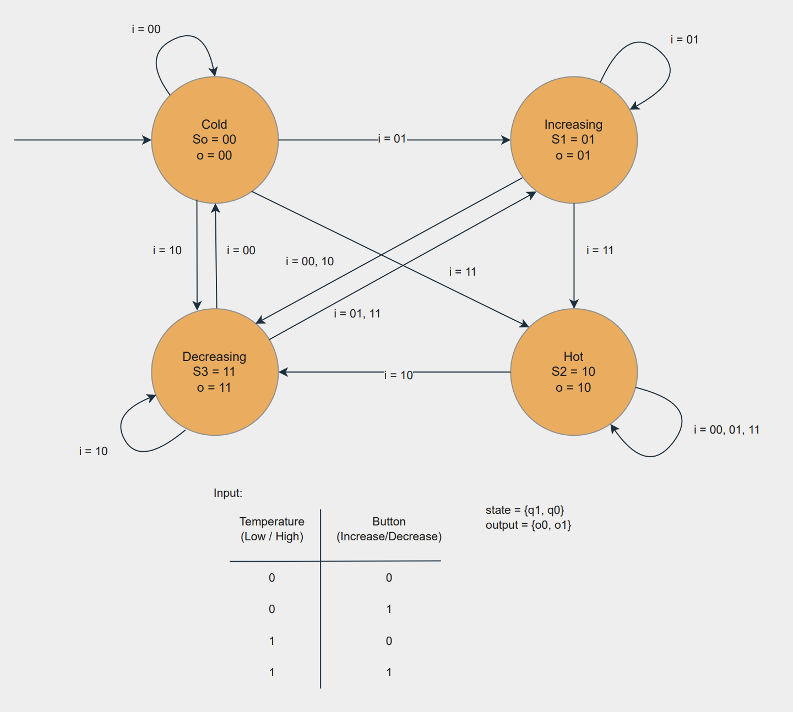
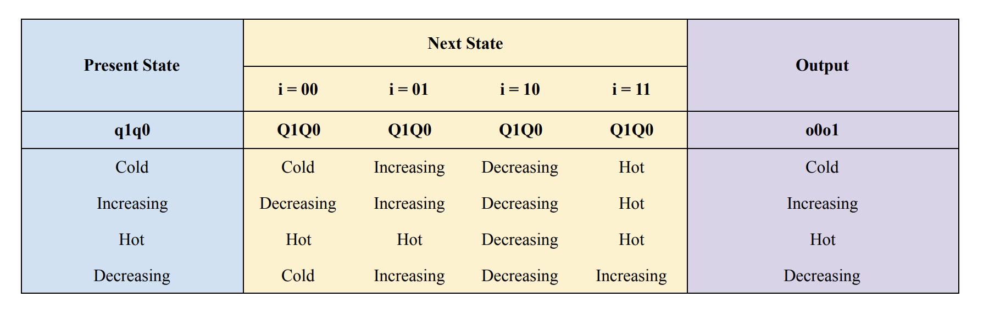
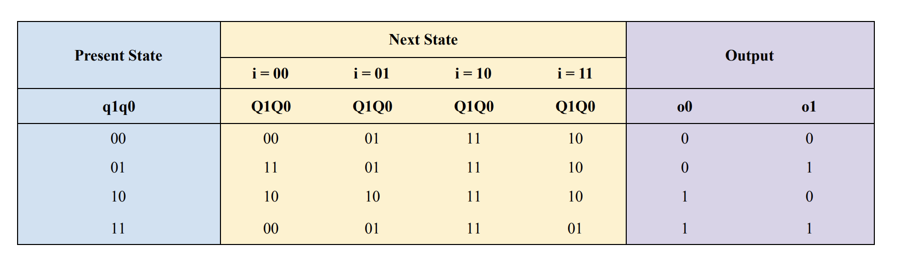
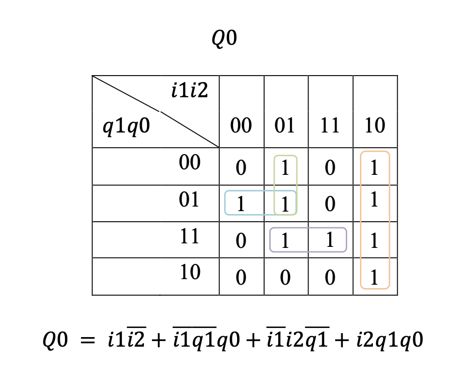
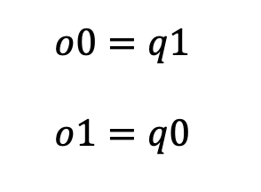
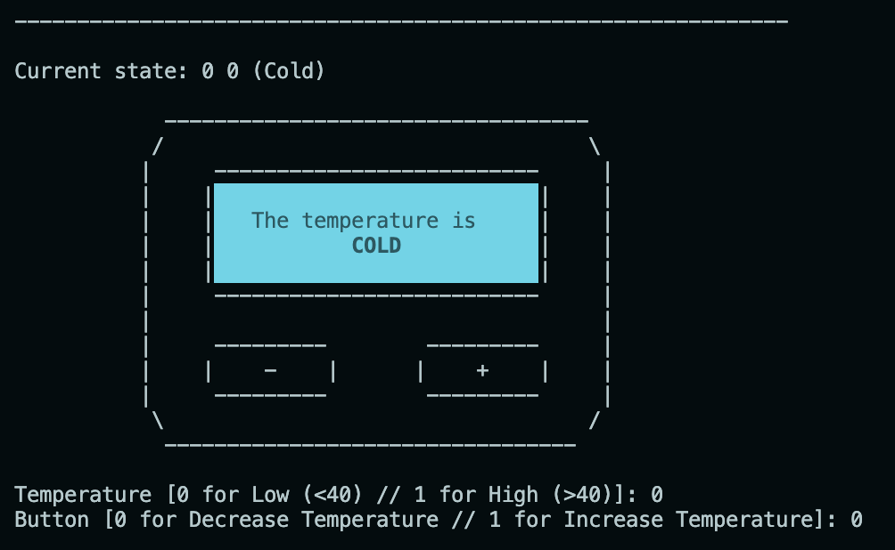
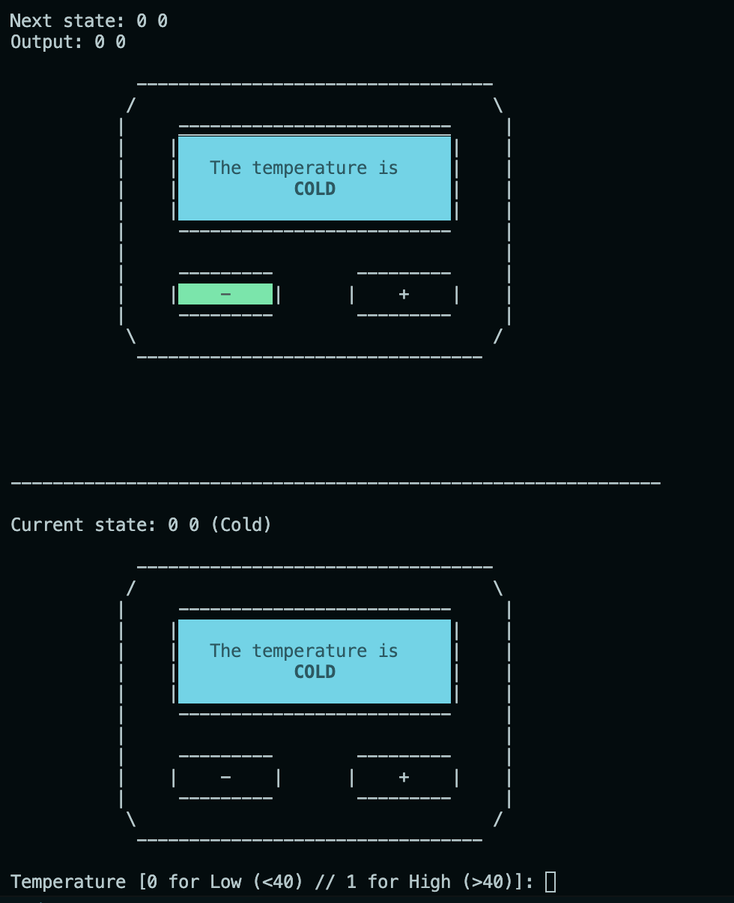
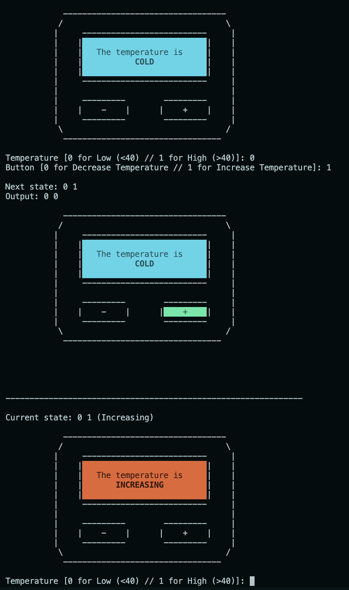
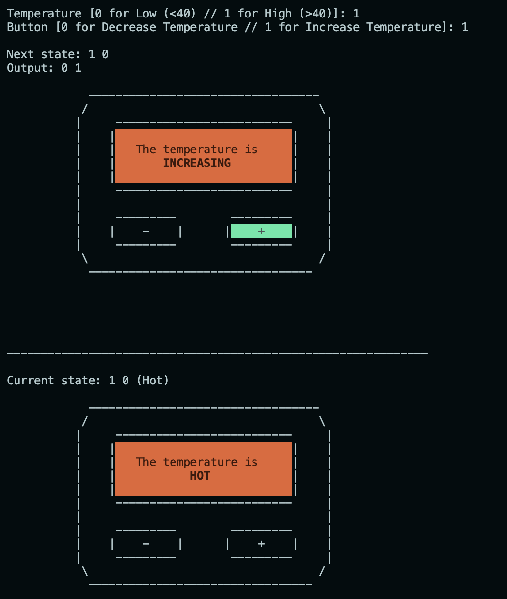
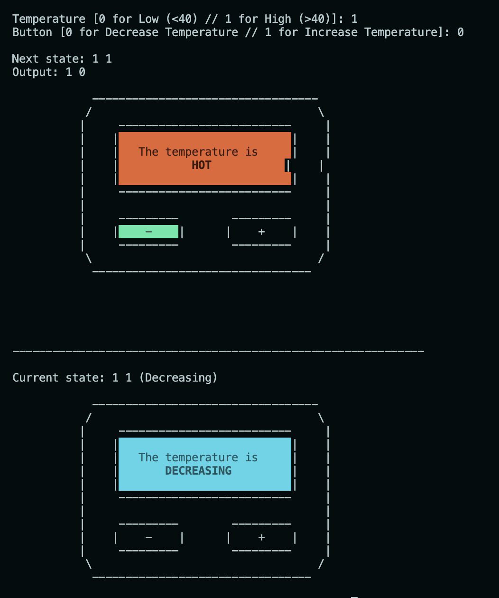

# Temperature Controller with Finite State Machine

This repository contains the implementation of a temperature controller utilizing the Finite State Machine concept written in C. 

## Description 

This temperature controller with finite state machine is a logical system that controls the temperature of a bath or shower by transitioning between different states based on the input conditions.

It has four states: "Cold", "Increasing", "Hot", and "Decreasing" with "Cold" being the initial state. 
The input conditions for the FSM are the temperature and the button press. The temperature can be either "Low" (0) or "High" (1), with "Low" representing a temperature below 40°C and "High" representing a temperature of 40°C or higher. The button press can be either "Decrease" (0) or "Increase" (1), with "Decrease" representing the condition when the decrease button is pressed and "Increase" representing the condition when the increase button is pressed. 

The temperature of the shower is controlled by pressing the "Increase" or "Decrease" button. If the temperature is low (below 40°C) and the "Increase" button is pressed, the state will change to "Increasing". If the temperature is high (above 40°C) and the "Increase" button is pressed, the state will change to "Hot".

## FSM Model

#### State Transition Diagram


#### Truth Table 





```
Present State = q1q0 -> Cold (00), Increasing (01), Hot (10), Decreasing (11)
Next State = Q1Q0 -> Cold (00), Increasing (01), Hot (10), Decreasing (11)
Output = o1o2 -> Cold (00), Increasing (01), Hot (10), Decreasing (11)

Input = i1, i2
i1 = Temperature [Low (below 40) = 0 / High (at or above 40)= 1]
i2 = Button [Decrease = 0 / Increase = 1]
```

#### K-map

- ##### Next State (Q1) K-map
    

- ##### Next State (Q0) K-map
    

- ##### Output (o0, o1) K-map
    

From all the diagrams and tables, I got the equations for each next state and output: 
```
Q1 = (i1 & (!i2)) | (q1 & (!q0)) | (i1 & (!q1)) | ((!i2) & (!q1) & q0)
Q0 = (i1 & (!i2)) | ((!i1) & (!q1) & q0) | ((!i1) & i2 & (!q1)) | (i1 & q1 & q0)

o0 = q1
o1 = q0
```

## How to Run

Follow these steps to run and test the code: 

1. Download the zip folder of all the files in this repository 
2. Open the unziped folder in your IDE (VSCode).
3. In your IDE, type command `make` in your IDE terminal and the program will start running.
4. If you do not use an IDE, open your terminal and direct to this corresponding folder using `cd <folder path>` and type command `make`


## Testing



This is the first view of the program where it starts from the initial state (00 = "COLD") and it asks for inputs such as the temperature and the button. 



After entering the temperature and button, it will print out the next state, the output, and the temperature controller with green colour in which button is pressed. 

The program will rerun and print the new temperature controller according to the next state that we got from the last inputs. In this case, the temperature will still in cold state because the temperature is already at its minimum level (i.e., below 40°C) and the button press is "Decrease" (0), so the temperature cannot decrease further (the previous state is "Cold" (00) and the temperature is "Low" (0) and the button press is "Decrease" (0))

#### Further Testing






=======
# Please go to branch master to see all the completed files. 
>>>>>>> e2f42ee6b10c5813179ced10eaba88e3ae1b9bd4
=======
# Please go to branch master to see all the completed files. 
>>>>>>> e2f42ee6b10c5813179ced10eaba88e3ae1b9bd4
